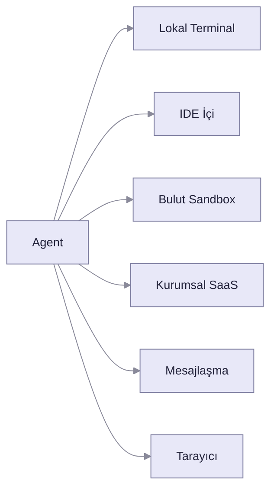

Title: Bir Agent Nerede Yaşar?
Date: 2026-07-14 10:00
Category: AI
Tags: yapay-zeka, agent, harness, context-engineering, mcp, llm
Slug: agent-nerede-yasar
Series: Vibe Coding'den Agentic AI'a
Summary: Agent'ın ne olduğunu konuştuk. Peki bu şey fiziksel olarak nerede duruyor? Terminalde mi, bulutta mı, kurumsal bir SaaS'ın içinde mi? Cevap sandığınızdan önemli, çünkü agent'ın adresi kontrolün kimde ve verinin nerede olduğunu belirliyor.

Bu yazıyı yazmaya başladığımda, beş ay önce yayımladığım bir yazıdaki linki düzeltmek zorunda kaldım.

O yazıda IDE'nin geleceğini anlatırken Windsurf'ü canlı bir örnek olarak göstermiştim. 2 Haziran 2026'da Cognition, Windsurf IDE'sini Devin Desktop olarak yeniden adlandırdı; marka yalnızca VS Code ve JetBrains eklentisinde yaşamaya devam ediyor. Windsurf'ün agent'ı Cascade ise 1 Temmuz'da tamamen kapandı, yerini Devin Local aldı. Aynı haftalarda Google, Gemini CLI'ı 18 Haziran'da ücretsiz ve Pro/Ultra katmanlarına kapatıp Antigravity CLI'a taşıdı; eski istemci ancak ücretli Code Assist ve Cloud kanallarından erişilebilir durumda kaldı.

Beş ay. Üç ürün. Yazdığım cümle hâlâ doğruydu, ama gösterdiğim adres artık yoktu.

Bu yeni de değil. Microsoft, Ekim 2025'te AutoGen ve Semantic Kernel'i Agent Framework çatısı altında birleştirip ikisini de bakım moduna almıştı; çatının 1.0 sürümü Nisan 2026'da çıktı. Araçlar ölmüyor sadece, birbirinin içine de göçüyor.

Bu yüzden bu yazı bir araç listesi olmayacak. Araç listeleri ölüyor. Bunun yerine ölmeyen bir soruyu soracağım: **bir agent fiziksel olarak nerede yaşar ve bu adres neyi belirler?**

Serinin [ilk yazısında](/blog/vibe-codingden-ajanlar-cagina) paradigmanın nasıl kaydığını anlattım. [İkinci yazıda](/blog/chatbot-mu-agent-mi) "agent" kelimesinin altında gerçekte ne olduğunu ayıkladım. [Üçüncüsünde](/blog/vibe-coding-in-carptigi-duvar) bu araçların gerçek bir legacy codebase'de nereye çarptığını yazdım. Şimdi eksik kalan parça: LLM'e beden verdik dedik, peki bu beden nerede duruyor?

## Aynı Model, Farklı Beden

Bir düşünce deneyi yapalım. Claude'u tarayıcıda claude.ai üzerinden açtığınızda size kibarca cevap veren bir sohbet arkadaşı buluyorsunuz. Aynı Claude'u terminalde Claude Code olarak çalıştırdığınızda, saatlerce dosya okuyan, test koşturan, hata ayıklayan bir mühendis buluyorsunuz.

Model aynı. Ağırlıklar aynı. Davranış tamamen farklı.

Aradaki fark **harness** denen şeyde: modelin etrafına sarılmış runtime katmanı. Harness konuşma geçmişini yönetir, tool çağrılarını çalıştırır, sisteme erişim verir, context penceresini derler toplar ve döngünün ne zaman duracağına karar verir. Model tek başına bir sonraki token'ı tahmin eden durumsuz bir fonksiyondur. Onu agent yapan şey harness'tır.

Simon Willison, Eylül 2025'te alanın nihayet üzerinde uzlaştığı [tanımı](https://simonwillison.net/2025/Sep/18/agents/) şöyle özetledi: *"An LLM agent runs tools in a loop to achieve a goal."* Bir hedefe ulaşmak için araçları döngüde çalıştıran LLM. Bu tanımdaki "döngü" harness'ın kendisidir.

Anthropic, Nisan 2026'da yayımladığı [Managed Agents yazısında](https://www.anthropic.com/engineering/managed-agents) bir agent'ı üç sanallaştırılmış bileşene ayırıyor: **session** (olan biten her şeyin salt-eklenen kaydı), **harness** (Claude'u çağırıp onun tool çağrılarını ilgili altyapıya yönlendiren döngü) ve **sandbox** (Claude'un kod çalıştırıp dosya düzenlediği ortam). Yazının kendi ifadesiyle:

> *"The solution we arrived at was to decouple what we thought of as the 'brain' (Claude and its harness) from both the 'hands' (sandboxes and tools that perform actions) and the 'session' (the log of session events)."*

Beyin: Claude ve harness'ı. Eller: eylemi fiilen yapan sandbox ve araçlar. Üçü birbirinden ayrılabiliyor; biri diğerini bozmadan değiştirilebiliyor.

İlk yazıda "LLM bir beyin, ona beden lazım" demiştim. Şimdi tabloyu tamamlayabiliriz: beynin ve elin aynı yerde olması zorunlu değil. Agent'ın adresi dediğimiz şey, aslında elin nerede durduğudur.

Aynı yazının açılış cümlesi ise bu blog yazısının da özrü sayılır: *"Harnesses encode assumptions that go stale as models improve."* Harness'ler, modeller iyileştikçe bayatlayan varsayımları kodlar. Windsurf'ün beş ayda ölmesi bir talihsizlik değil, bu cümlenin doğal sonucu.

## Adres Haritası

Agent'lar bugün altı farklı yerde yaşıyor. Her adresin kendi kontrol modeli, kendi güvenlik yüzeyi ve kendi maliyet profili var.

**Lokal terminal.** Agent sizin makinenizde, sizin kabuğunuzda, sizin dosyalarınızla çalışır. Claude Code, OpenAI Codex CLI, OpenCode, Aider, Cline bu kategoride. Kontrol tamamen sizde; veri makinenizden çıkmaz (modele gönderilen context hariç). Bedeli şudur: agent'ın yapabileceği hasarın sınırı, sizin kullanıcı hesabınızın yetkisidir.

Bu adresin etrafında son bir yılda yeni bir katman büyüdü. Onlarca açık kaynak proje, terminaldeki agent'ları paralel koşturmak, her birine ayrı bir çalışma kopyası vermek ve çıktılarını birbirine denetletmek için yazıldı. Birileri "coding agent'lar için htop" bile yazdı: canlı oturumlar, context penceresi doluluğu, anlık token maliyeti. Yanlarında ikinci bir küme belirdi: agent'ın hangi komutu çalıştırabileceğini varsayılan olarak reddeden sandbox'lar, geri alınamaz eylemlerin önüne onay geçidi koyan politika katmanları, her adımı imzalayıp denetim kaydına yazan araçlar. Kimse bunları eğlence olsun diye yazmıyor. Agent'ın adresi tek bir terminal olmaktan çıkıp izlenmesi gereken bir filoya dönüştüğü anda, harness'ın zorlayıcı kısmı bir ürüne dönüşüyor. Bu yazının sonunda konuşacağımız kırılma noktalarının pazar cevabı bunlar.

**IDE içi.** Cursor ve GitHub Copilot'ın agent modu burada. Agent editörün içinde yaşar, siz her diff'i görürsünüz. Otonomi düşük, gözetim yüksek. Hızlı iterasyon için ideal, uzun görevler için değil.

**Bulut sandbox.** Görevi verirsiniz, agent uzakta izole bir ortamda çalışır, size bir pull request ile döner. GitHub Copilot'ın coding agent'ı, Cursor'ın background agent'ları, Devin, Google Jules ve Anthropic'in Managed Agents'ı (halen public beta) bu desende. Buradaki kazanç paralellik: beş görev kuyruğa atar, beş PR alırsınız. Buradaki risk ise agent'ın ne yaptığını canlı görmemeniz.

Sandbox'ın nasıl izole edildiği önemsiz bir detay değil. Firecracker gibi microVM'ler her agent'a ayrı bir kernel verir; container tabanlı çözümler kernel'i paylaşır, çok daha hızlı başlar ama izolasyon sınırı zayıftır. Agent, güvenilmez girdilerden otonom olarak kod üretip çalıştırdığı için bu sınır teorik değil pratiktir.

**Kurumsal SaaS.** Microsoft Copilot Studio, Salesforce Agentforce, ServiceNow, AWS Bedrock AgentCore. Agent kurumun verisinin zaten durduğu yerde yaşar. Kullanıcı bir şey kurmaz, bir şey seçmez.

**Mesajlaşma yüzeyi.** Son bir yılın en çok ilgi gören iki açık kaynak projesi burada: [OpenClaw](https://openclaw.ai) ve Nous Research'ün [Hermes Agent](https://github.com/NousResearch/hermes-agent)'ı. İkisi de aynı fikirde birleşiyor: agent sizin sunucunuzda tek bir gateway süreci olarak koşar, siz ona WhatsApp, Telegram, Slack ya da Signal gibi zaten kullandığınız bir kanaldan görev yollarsınız. Adres sizin, arayüz telefonunuz. İkisi de MIT lisanslı; 14 Temmuz 2026 itibarıyla OpenClaw 382 bin, Hermes 214 bin GitHub yıldızında.

Hermes'in dokümantasyonundaki bir ayrıntı bu yazının tezini neredeyse birebir doğruluyor: agent aynı kalırken komutlarını altı farklı yerde çalıştırabiliyor: lokal makine, Docker, SSH ile uzak sunucu, Singularity, Modal, Daytona. Beyin tek bir yerde, eller altı ayrı adreste. Modal ve Daytona arkasında ortam boştayken uykuya geçiyor, görev gelince uyanıyor; yani agent'ın "yaşadığı yer" artık bir makine bile olmayabiliyor.

Bu kolaylığın bedeli ağır. Agent'ınıza WhatsApp'tan mesaj ulaşıyorsa, size yazabilen herkes ona talimat verebilir demektir. Saldırı, gelen kutunuzdan geliyor.

**Tarayıcı.** Claude in Chrome ve benzeri computer-use agent'ları sayfayı görür ve tıklar. En yeni ve en kırılgan adres. Buradaki tehlike gelen mesaj değil, açılan sayfanın kendisi: tarayıcı tanımı gereği güvenilmez içerikle dolu.

## Asıl Soru Araç Değil

Şimdi listeyi bir kenara bırakıp altındaki ilkeye bakalım.

Bir geliştirici olarak agent'ınızın nerede yaşayacağını **siz seçersiniz**. Terminali mi, bulut sandbox'ı mı, kendi sunucunuzu mu? Modeli, araçları ve izin sınırlarını kendi elinizle kurarsınız.

Kurumsal bir kullanıcı olarak bu seçim size ait değildir. Agent, şirketin verisinin durduğu yerde yaşar. Copilot Studio'da kurduğunuz agent Microsoft 365 tenant'ınızın içindedir. Agentforce, Salesforce'un içindedir. Adres, veriyi takip eder.

Teknik ve teknik olmayan kullanıcı arasındaki gerçek fark yetenek değil. **Kontrolün ve verinin nerede durduğu.** Bu cümle, listedeki bütün ürünler öldükten sonra da doğru kalacak.

## No-code Agent Gerçekten Agent mı?

Buraya kadar geldiysek dürüst bir soru sormamız gerekiyor.

Anthropic'in [Building Effective Agents](https://www.anthropic.com/engineering/building-effective-agents) yazısındaki ayrım keskin: **workflow**, LLM'lerin ve araçların önceden yazılmış kod yollarıyla orkestre edildiği sistemdir: deterministik, tahmin edilebilir. **Agent** ise LLM'in kendi sürecini ve araç kullanımını dinamik olarak yönlendirdiği, görevi nasıl yapacağına kendisinin karar verdiği sistemdir.

Bu mercekten bakınca no-code araçlarının önemli bir kısmı (Zapier Agents, Make, Copilot Studio'da kurulan senaryoların çoğu) pratikte gelişmiş workflow'dur. Tetikleyici, adımlar, dallanma. Serinin ikinci yazısındaki pratik testi hatırlayın: hedefi verip elinizi çektiğinizde sistem kendi başına yol buluyor mu? Çoğunda cevap hayır.

Gartner bu duruma bir isim koydu: **agent washing.** Mevcut chatbot'u, RPA'yı ya da asistanı, altında esaslı bir agent yeteneği olmadan "agentic" diye yeniden etiketlemek. [Haziran 2025'teki değerlendirmelerinde](https://www.gartner.com/en/newsroom/press-releases/2025-06-25-gartner-predicts-over-40-percent-of-agentic-ai-projects-will-be-canceled-by-end-of-2027) binlerce agentic AI satıcısından yalnızca yaklaşık 130'unun gerçek olduğunu tahmin ediyorlar. Aynı yerde agentic AI projelerinin %40'ından fazlasının 2027 sonuna kadar iptal edileceğini öngörüyorlar: artan maliyet, belirsiz iş değeri ve yetersiz risk kontrolü yüzünden.

Ama şunu net söyleyeyim: **workflow olmak kusur değil.** Deterministik bir işi agent'a sarmak onu akıllı yapmaz; yavaş, pahalı ve hata ayıklaması zor yapar. Fatura kesme akışınızın her seferinde aynı şeyi yapması bir özelliktir, eksiklik değil. Sorun, workflow'a agent demekte.

İstisnalar da var. [n8n'in AI Agent node'u](https://docs.n8n.io/integrations/builtin/cluster-nodes/root-nodes/n8n-nodes-langchain.agent/) LangChain'in tool-calling arayüzü üzerine kurulu: model hangi aracı kullanacağına kendisi karar veriyor ve hedefe ulaşana kadar döngüde kalıyor. Döngünün kaç tur döneceği bir parametre: varsayılanı on tur. Riskli bir araç çağrısında akış durup Slack ya da Telegram üzerinden insan onayı isteyebiliyor; yani serinin ilk yazısında konuştuğumuz HITL geçidi, no-code bir arayüzde. Tanımı karşılıyor.

## Teknik Tarafta Agent'ı Nerede Tanımlarsınız

Kendi pratiğimden gideyim: Claude Code'un üstünde agent tanımlıyorum. Bunun nasıl yapıldığı, "agent nerede yaşar" sorusunun en somut cevabı, çünkü agent'ın her parçası bir dosyaya karşılık geliyor.

[Subagent'lar](https://docs.claude.com/en/docs/claude-code/sub-agents) `.claude/agents/` altında birer markdown dosyası olarak yaşar. Her birinin kendi sistem promptu, kendi araç listesi, kendi izin modu vardır. En önemlisi kendi context penceresi vardır: subagent on binlerce token harcayıp ana agent'a sadece damıtılmış bir özet döndürür.

`CLAUDE.md` projenin kökünde durur ve agent'a kalıcı bağlam verir. **Skills** ihtiyaç anında yüklenen yetenek paketleridir; kullanılana kadar bağlamda yalnızca adı ve tek satırlık açıklaması durur, gövdesi ancak tetiklendiğinde yüklenir. **MCP sunucuları** agent'ı dış araçlara ve veri kaynaklarına bağlar. **Hook'lar** yaşam döngüsü olaylarında kabuk komutu çalıştırır.

Burada insanlara anlatırken en çok kafa karıştıran ayrım şu: `CLAUDE.md` **bir ricadır, [hook](https://docs.claude.com/en/docs/claude-code/hooks) bir kuraldır.** "Şu klasöre yazma" diye talimat yazarsanız model çoğu zaman uyar, bazen unutur. Aynı şeyi `PreToolUse` hook'uyla yazarsanız, model ne isterse istesin işlem gerçekleşmez. Model ikna edilir; harness zorlar.

Bu ayrım tesadüfi değil. HumanLayer'ın [12-Factor Agents](https://github.com/humanlayer/12-factor-agents) derlemesinin çekirdek mesajı da tam olarak budur: kontrolü framework'e teslim etme. Kendi promptuna, kendi context penceresine, kendi kontrol akışına sahip çık.

## Kod Yazmıyorsanız Nereden Başlarsınız

Buraya kadar okuyup "bunların hiçbiri benim işim değil" diyorsanız, yanılıyorsunuz. Adres sorusu sizin için daha da kritik, çünkü sizin adresinizi başkası seçiyor.

Somut bir yerden başlayın: **agent'ı veriniz nerede duruyorsa oraya kurun.** Şirket dokümanlarınız SharePoint'te ve Teams'te yaşıyorsa Copilot Studio doğal adres. Müşteri verisi Salesforce'taysa Agentforce. Veri bir yerdeyken agent'ı başka yere kurmak, entegrasyon maliyetini işin kendisinden büyük hale getirir. Bir şey inşa etmeden önce şu üçünü taşıyan bir agent kurmayı deneyin: dar bir görev, ölçülebilir bir çıktı ve geri alınabilir bir eylem.

Buradaki fikir aslında tanıdık. OpenClaw ve Hermes "agent zaten bulunduğun yerde yaşasın" diyor ve WhatsApp'a geliyor. Kurumsal tarafta aynı fikrin adı Teams. Copilot Studio'da kurduğunuz bir agent'ı [Teams kanalına yayımlıyorsunuz](https://learn.microsoft.com/en-us/microsoft-copilot-studio/publication-add-bot-to-microsoft-teams) ve ekip ona gün boyu kullandığı sohbet penceresinden yazıyor. Yeni bir uygulama yok, yeni bir alışkanlık yok.

İki ayrıntı bu yazıda anlattığımız her şeyi özetliyor. Birincisi: Teams'e yayımlanan agent varsayılan olarak Entra ID ile kimlik doğruluyor. Yani kurumsal agent'ın bir kimliği *var*; birazdan göreceğimiz gibi terminaldeki agent'ın yok, o sizinkini ödünç alıyor. İkincisi: Microsoft, grup sohbetlerinde agent'ın SharePoint gibi kullanıcı yetkisi gerektiren kaynakları kullanmasını bilerek engelliyor. Sebep basit: grup sohbetindeki agent, o gruptaki herkese, hiçbirinin görmemesi gereken bir belgeyi okuyabilir. Kurumsal bir ürün, güvenlik sınırını sizin yerinize çizmiş oluyor. Kolaylık bu; bedeli de sınırı sizin çizememeniz.

Bir satıcı karşınıza geçtiğinde soracağınız soru fiyat değil. Serinin ikinci yazısındaki pratik testi sorun: hedefi verip elinizi çektiğinizde sistem kendi yolunu buluyor mu? Buluyorsa agent. Önceden çizilmiş adımları yürüyorsa workflow, ki bu kötü değil. Yeter ki workflow'a agent fiyatı ödemeyin.

Sonra iki soru daha. Agent kimin adına konuşuyor, denetim kaydında kim görünüyor? Ve yanlış yaparsa ne kadar zarar verebilir?

İkincisi en önemlisi. Bir agent'a verdiğiniz yetkinin sınırı, o agent'ın en kötü gününde yapabileceği şeyin sınırıdır.

Şunu da bilin: no-code olmak sizi gerçek agent'lardan mahrum bırakmıyor. Az önce konuştuğumuz n8n bunun kanıtı. Fark yine yetenek değil, kontrolün nerede durduğu.

## Hafıza Nerede Yaşar?

Sezgisel cevap "context window'da" olur. Yanlış.

Anthropic'in [context engineering yazısı](https://www.anthropic.com/engineering/effective-context-engineering-for-ai-agents) bunu **context rot** diye adlandırdığı bir olguyla açıklıyor: context penceresindeki token sayısı arttıkça modelin oradan doğru bilgi hatırlama yeteneği düşer. Sebep mimaride: transformer'da n token, n² ikili ilişki demektir. Modelin sonlu bir "dikkat bütçesi" vardır ve her yeni token o bütçeden yer.

Yazının önerdiği ilke şu: *"Find the smallest set of high-signal tokens that maximize the likelihood of your desired outcome."* İstediğiniz sonucu en olası kılan, en küçük yüksek-sinyalli token kümesini bulun.

Sonuç olarak agent'ın uzun süreli hafızası context'te değil, **dosya sisteminde** yaşar. Agent not tutar, notu okur, konuşma özetlenip sıfırlandığında not yerinde durur. Anthropic'in [ölçümüne göre](https://www.anthropic.com/news/context-management) memory tool ile context editing birlikte kullanıldığında ajanlı arama değerlendirmesinde %39 iyileşme sağlanıyor; context editing tek başına ise yüz turluk bir web arama testinde token kullanımını %84 azaltıyor.

Aynı deseni farklı ürünlerde görüyorsunuz. Claude Code'da skill'ler `.claude/skills/` altında dosya olarak durur. Hermes, karmaşık bir görevi bitirdikten sonra kendi kendine bir skill dosyası üretip `~/.hermes/skills/` altına yazar ve sonraki kullanımlarda onu iyileştirir. Agent'ın öğrendiği şey model ağırlıklarına değil, diske yazılıyor.

Yani agent'ın beyni modelde, hafızası diskte, elleri sandbox'ta. Üçü de farklı adreslerde.

## Agent Kimin Adına Konuşuyor?

Adresi konuştuk. Sorulmayan devamı şu: agent bir API'ye bağlandığında, hangi kimlikle bağlanıyor?

Terminalde çalışan agent sizin kullanıcı hesabınızın altında koşar. Sizin görebildiğiniz her dosyayı görür, sizin silebildiğiniz her şeyi silebilir. Kimliği yoktur; sizin kimliğinizi ödünç alır. Küçük ölçekte sorun değil. Ama kurumda otuz kişi otuz agent çalıştırdığında, denetim kaydında ne göreceksiniz? Volkan bir tablo sildi mi, Volkan'ın agent'ı mı sildi?

Sektör bu soruyu 2026'da ciddiye almaya başladı. Microsoft'un [Entra Agent ID](https://learn.microsoft.com/en-us/entra/agent-id/what-is-microsoft-entra-agent-id)'si 2026 baharında genel kullanıma açıldı ve agent'ı ilk sınıf bir kimlik olarak tanımlıyor. Modelin özü şu: agent kullanıcı adına iş yaptığında üretilen token'ın *öznesi* kullanıcı, *aktörü* agent olur. Kritik özellik, agent'ın kullanıcının kendi yetkisini asla aşamamasıdır. Arka planda kendi başına çalışan agent ise kendi kimliğiyle doğrulanır; oradaki disiplin de yetki kapsamını dar tutmaktır.

Çözülmemiş kısım onay. Bir agent'a "benim adıma Jira'da issue aç ama silme" demek istiyorsunuz. OAuth kapsamları bu cümleyi ifade edecek inceliğe sahip değil. Görevler, izinlerden daha soyut.

Protokol tarafında da tablo oturuyor. Anthropic, MCP'yi 9 Aralık 2025'te [Linux Foundation bünyesindeki Agentic AI Foundation'a bağışladı](https://www.anthropic.com/news/donating-the-model-context-protocol-and-establishing-of-the-agentic-ai-foundation); kurucular arasında Anthropic, Block ve OpenAI var. Bir şirketin protokolü olmaktan çıkıp sektörün protokolü oldu. Agent'ın araçlara nasıl bağlandığı artık tek bir vendor'ın insafına bırakılmış değil; bu da "hangi ürün hayatta kalır" sorusunu biraz daha önemsizleştiriyor.

## Nerede Kırılır

Adres sadece yeteneği değil, saldırı yüzeyini de belirler. Adres haritasında saydığım o sandbox'ların, onay geçitlerinin ve denetim kayıtlarının neden yazıldığını şimdi konuşalım.

Simon Willison'ın [lethal trifecta](https://simonwillison.net/2025/Jun/16/the-lethal-trifecta/) dediği şey üç yeteneğin bir arada bulunmasıdır: özel veriye erişim, güvenilmez içeriğe maruz kalma ve dışarıyla iletişim kurabilme. Herhangi ikisi güvenlidir. Üçü birden ölümcüldür, çünkü saldırgan agent'ı kandırıp özel verinizi kendisine yollatabilir. Meta bunu [Agents Rule of Two](https://ai.meta.com/blog/practical-ai-agent-security/) adıyla bir tasarım kuralına çevirdi: bir oturumda bu üç özellikten en fazla ikisi bulunsun; üçü de gerekiyorsa agent otonom çalışmasın, insan onayı devreye girsin.

Güvenlik dışında iki matematiksel duvar daha var.

Birincisi bileşik hata. Adım başına %85 doğrulukla çalışan bir agent, on adımlık bir görevi uçtan uca yaklaşık **%20** olasılıkla tamamlar. Bu modelin zekasıyla ilgili değil, çarpma işlemiyle ilgili. İkincisi güvenilirlik uçurumu. [METR'in ölçümüne göre](https://metr.org/blog/2025-03-19-measuring-ai-ability-to-complete-long-tasks/) agent'ların tamamlayabildiği görev uzunluğu altı yıldır üstel biçimde büyüyor; yaklaşık yedi ayda ikiye katlanıyor. Ama bu rakam %50 başarı eşiğinde ölçülüyor. METR'in kendi ifadesiyle, en iyi modeller uzmanların saatlerini alan bazı görevleri yapabiliyor, buna karşılık *güvenilir biçimde* tamamlayabildikleri görevler yalnızca birkaç dakika uzunluğunda. Bu iki cümle arasındaki boşluk, agent demolarıyla agent production'ı arasındaki boşluğun ta kendisi.

Bu yüzden [MAST çalışmasının](https://arxiv.org/abs/2503.13657) vardığı sonuç şaşırtıcı değil. Berkeley ekibi yedi popüler multi-agent framework'ünden toplanan gerçek çalıştırma izlerini inceledi; 150 izin elle etiketlenmesinden on dört ayrı hata modu çıkardı ve etiketlemeyi 1600'ün üzerinde ize ölçekledi. On dört mod üç kategoride toplanıyor: sistem tasarımı sorunları, agent'lar arası uyumsuzluk ve görev doğrulama eksikliği. Üçü de modelin zekasıyla değil, etrafına kurulan sistemle ilgili.

Kurumsal tarafta tablo aynı yere çıkıyor. MIT'nin Project NANDA ekibinin Temmuz 2025'te yayımladığı [The GenAI Divide](https://www.artificialintelligence-news.com/wp-content/uploads/2025/08/ai_report_2025.pdf) raporu geniş yankı uyandıran bir rakam verdi: 30-40 milyar dolarlık kurumsal yatırıma rağmen kurumların %95'i ölçülebilir bir getiri elde edemedi.

Bu rakamı aktarırken dürüst olalım. Rapor kendini "ön bulgular" diye tanımlıyor, hakem denetiminden geçmiş bir MIT yayını değil, 52 kurumla yapılan görüşmelere dayanıyor ve metodolojisi eleştirildi. Dahası yazarları, sonuç bölümünde kendi geliştirdikleri NANDA protokolünü çözümün altyapısı olarak konumlandırıyor. Yani teşhisi koyan ekiple ilacı satan ekip aynı. Bu, bulguyu geçersiz kılmaz ama okurken akılda tutulmalı, hele bu yazının konusu agent washing'ken.

Yine de raporun asıl bulgusu rakamdan daha ilginç, çünkü buraya kadar anlattığımız her şeyle örtüşüyor:

> *"The core barrier to scaling is not infrastructure, regulation, or talent. It is learning. Most GenAI systems do not retain feedback, adapt to context, or improve over time."*

Ölçeklenmenin önündeki asıl engel altyapı, regülasyon ya da yetenek değil. Öğrenme. Sistemlerin çoğu geri bildirimi saklamıyor, bağlama uyum sağlamıyor, zamanla iyileşmiyor. Yani sorun modelin zekası değil, hafızasının nerede yaşadığı.

## Nereden Başlanır

Sıfırdan giriyorsanız, sırayla: Simon Willison'ın [agent tanımı](https://simonwillison.net/2025/Sep/18/agents/), Anthropic'in [Building Effective Agents](https://www.anthropic.com/engineering/building-effective-agents)'ı ve Lilian Weng'in alanın ortak dilini kuran [LLM Powered Autonomous Agents](https://lilianweng.github.io/posts/2023-06-23-agent/) yazısı.

Kurmaya başladıysanız: Anthropic'in [context engineering](https://www.anthropic.com/engineering/effective-context-engineering-for-ai-agents) ve [agent'lar için araç yazma](https://www.anthropic.com/engineering/writing-tools-for-agents) yazıları, Harrison Chase'in [aynı disiplini anlatan](https://blog.langchain.com/the-rise-of-context-engineering/) yazısı, [12-Factor Agents](https://github.com/humanlayer/12-factor-agents). Kurmadan önce de mutlaka [lethal trifecta](https://simonwillison.net/2025/Jun/16/the-lethal-trifecta/).

Çok-agent düşünüyorsanız, üçünü birlikte okuyun: Anthropic'in [multi-agent araştırma sistemi](https://www.anthropic.com/engineering/multi-agent-research-system), Cognition'ın karşı çıkan [Don't Build Multi-Agents](https://cognition.ai/blog/dont-build-multi-agents)'ı ve Cognition'ın Nisan 2026'da pozisyonunu keskinleştirdiği [devam yazısı](https://cognition.com/blog/multi-agents-working). Aynı olguya iki zıt değer atfını görmek, tek bir yazıdan daha çok şey öğretiyor.

Derine inecekseniz Anthropic'in [Managed Agents](https://www.anthropic.com/engineering/managed-agents) yazısı ve [MAST makalesi](https://arxiv.org/abs/2503.13657).

Kod yazmıyor ama karar veriyorsanız ikisi yeter: Gartner'ın [agent washing değerlendirmesi](https://www.gartner.com/en/newsroom/press-releases/2025-06-25-gartner-predicts-over-40-percent-of-agentic-ai-projects-will-be-canceled-by-end-of-2027) ve MIT NANDA'nın [GenAI Divide](https://www.artificialintelligence-news.com/wp-content/uploads/2025/08/ai_report_2025.pdf) raporu; ikincisini yukarıda anlattığım çekinceyle okuyun.

## Geride Kalmamak Neye Bağlanmaktır?

Karpathy, Nisan 2026'da [Sequoia Ascent'te](https://karpathy.bearblog.dev/sequoia-ascent-2026/) şunu söyledi:

> *"Vibe coding raises the floor. Agentic engineering is about extrapolating the ceiling."*

Vibe coding tabanı yükseltir. Agentic engineering tavanı zorlar. Bu serinin adını daha iyi özetleyen bir cümle bulamazdım.

Ama aynı konuşmada modeller için kullandığı tanım daha kıymetli: **jagged, alien tools**: tırtıklı, yabancı araçlar. Doğru duruş ne toptan reddetmek ne körü körüne güvenmek. Doğru duruş *ampirik aşinalık*: kullanacaksın, sınırını göreceksin, nerede kırıldığını bileceksin.

Geride kalmamak için bir araç öğrenmek zorunda değilsiniz. Windsurf öğrenenler beş ay sonra Devin Desktop öğrenmek zorunda kaldı. Öğrenmeniz gereken şey ilke: **agent'ın adresi kontrolün kimde ve verinin nerede olduğunu belirler.** Terminaldeki agent'ta ikisi de sizde. SaaS'taki agent'ta ikisi de vendor'da. Bulut sandbox'taki agent'ta beyin bir yerde, eller başka yerde.

Bunun en somut kanıtı Hermes'in kurulum sihirbazında duruyor. `hermes claw migrate` komutu, OpenClaw kullanıcısının persona dosyasını, hafızasını, kendi yazdığı skill'leri ve komut izin listesini alıp yeni agent'a taşıyor. Araç değişti; kavramlar taşındı. Çünkü taşınabilir olan şey ürün değil, ürünün altındaki yapıydı: bir persona dosyası, bir hafıza dizini, bir izin sınırı.

Öğrenmeniz gereken şey o yapı. Bu soruyu sorabiliyorsanız, hangi ürünün hayatta kaldığının bir önemi yok.

---

*Bu yazı bir serinin dördüncü bölümü. Paradigma kayması için [Vibe Coding'den Ajanlar Çağına](/blog/vibe-codingden-ajanlar-cagina), kavram netliği için ["Agent" Dediğinizde Ne Kastediyorsunuz?](/blog/chatbot-mu-agent-mi), saha notu için [Vibe Coding'in Çarptığı Duvar](/blog/vibe-coding-in-carptigi-duvar).*
