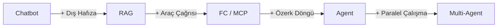

Title: "Agent" Dediğinizde Ne Kastediyorsunuz?
Date: 2026-03-10 10:00
Category: AI
Tags: yapay-zeka, agent, chatbot, rag, mcp, llm
Slug: chatbot-mu-agent-mi
Summary: "Agent" kelimesi her yerde — ürün sayfalarında, iş ilanlarında, LinkedIn paylaşımlarında. Ama çoğu zaman altına bakınca görünen şey daha akıllı bir chatbot. İkisi arasındaki fark ne, nasıl ayırt edersiniz?

Her ürün sayfasında "AI agent" yazıyor. İş ilanları "agentic AI deneyimi" arıyor. Bir startup size "ajanımız var" diyor.

Ama birinin "agent" demesi, gerçekten bir ajan kullandıkları anlamına gelmiyor.

Bu bir eleştiri değil — kavramların yerleşmesi zaman alır, piyasa her yeni teknolojiyi önce yanlış isimlendirip sonra düzeltir. Ama farkı bilmeden doğru aracı seçemezsiniz, doğru soruyu soramazsınız. Bu yüzden netleştirelim.

## Chatbot Nedir?

Chatbot tepkiseldir. Siz yazarsınız, o cevap verir. Siz tekrar yazarsınız, o tekrar cevap verir. İnisiyatif hiçbir zaman onda değildir — her adım sizden gelir.

Sohbet penceresi kapandığında hafıza sıfırlanır. Araçları yoktur: size "şöyle yapabilirsiniz" der, ama kendisi yapmaz. Bir bilgi kaynağıdır — hızlı, erişilebilir, bazen hatalı.

Pek çok chatbot'un arkasında güçlü bir dil modeli var. GPT-4, Claude, Gemini — bunların hepsi chatbot arayüzü üzerinden kullanılabiliyor. Ama model ne kadar güçlü olursa olsun, eğer yapı tepkiseliyse — soru sor, cevap al — bu bir chatbot'tur.

Onlarca yıl boyunca "yapay zeka" denince akla ilk gelen şey buydu. Sayfanın sağ alt köşesinde küçük bir balondu: "Merhaba! Size nasıl yardımcı olabilirim?" Tıklarsınız, birkaç seçenek çıkar, birine tıklarsınız, bir yardım makalesine yönlendirilirsiniz. Bazen işe yarar, çoğunlukla yaramaz. Kullanıcılar zamanla öğrendi: chatbot iş yapılan yer değil, başka bir yere yönlendirildiğiniz yerdir.

## Agent Nedir?

Agent'ın temel farkı şudur: hedefe yöneliktir.

Chatbot'a "rakip fiyatlarını nasıl analiz edebilirim?" diye sorarsınız, size yöntem anlatır. Agent'a "rakip fiyatlarını analiz et, karşılaştırma raporu çıkar" dersiniz — o araştırır, karşılaştırır, döküman oluşturur. Siz sadece sonucu görürsünüz.

Bunu mümkün kılan üç şey var.

**Araçlar.** Agent bir dil modelinin ötesinde bir sisteme bağlıdır: web araması yapabilir, dosya okuyup yazabilir, kod çalıştırabilir, API çağrısı yapabilir. Konuşmakla kalmaz, hareket eder.

**Döngü.** Chatbot bir tur oynar — soru, cevap, bitti. Agent iterasyon yapar. Bir adım atar, sonucu değerlendirir, gerekirse yönünü değiştirir ve devam eder. Hedefe ulaşana kadar.

**Hafıza.** Bir adımda öğrendiğini bir sonraki adıma taşır. Bağlam kaybolmaz, çünkü sohbet penceresi değil, görev yönetir.

Anthropic'in tanımı bunu en iyi özetliyor: *"Agents are systems where LLMs dynamically direct their own processes and tool usage, maintaining control over how they accomplish tasks."* Kendi sürecini kendisi yönetir. Bu kritik.

| | Chatbot | Agent |
|---|---|---|
| Kim başlatır? | Her adımda insan | İnsan sadece hedefi verir |
| Hafıza | Sohbet biter, sıfırlanır | Adımlar arası taşınır |
| Araç kullanımı | Yok | Dosya, API, kod, arama |
| Döngü | Tek tur | Hedefe kadar iterasyon |
| Örnek | ChatGPT, Claude.ai | Claude Code, OpenClaw |

## Aradaki Gri Alan

Chatbot ile agent arasında siyah-beyaz bir çizgi yok. Kavramların çoğu bu ikisi arasında bir yerde duruyor — ve tam da bu yüzden kafa karışıklığı yaşanıyor.

**Fine-tuning**, modeli belirli bir alan ya da tona göre yeniden eğitmektir. "Hukuk terminolojisini daha iyi anlayan model" veya "bizim yazım stilimizde cevap veren model" gibi. Önemli bir teknik ama chatbot/agent ayrımından bağımsız bir boyut — fine-tuned bir model hâlâ chatbot olabilir, fine-tuning yapılmamış bir model hâlâ agent olabilir.

**RAG (Retrieval-Augmented Generation)**, chatbot'a dış hafıza kazandırmanın en yaygın yoludur. Model cevap üretmeden önce bilgi tabanından ilgili belgeleri çeker ve o bağlamla konuşur. Şirket dökümanlarını, ürün kılavuzlarını, güncel verileri modelin erişimine açar. Halüsinasyonu azaltır, yanıtları somutlaştırır. Ama yapı hâlâ tepkiseldir — siz soruyorsunuz, o buluyor ve cevaplıyor. RAG olan her sistem agent değildir.

**Function Calling**, modele dış araç çağırma yeteneği vermektir. Hava durumu API'si, veritabanı sorgusu, takvim entegrasyonu — model "bu işi araçla yapayım" diye karar verir ve çağrıyı yapar. Güçlü bir özellik. Ama şu soruyu sorun: kim yönetiyor? Siz her soruda tetikliyorsanız, sistem hâlâ tepkiseldir. Function calling olan sistem, agent değil — araçlı chatbot'tur.

**[MCP (Model Context Protocol)](https://modelcontextprotocol.io/)**, Anthropic'in 2024'te açık kaynak olarak yayımladığı ve hızla endüstri standardına dönüşen bir protokoldür. OpenAI, Google, Microsoft, Amazon — büyük oyuncuların tamamı benimsedi; [2026 itibarıyla aylık 97 milyonun üzerinde SDK indirmesiyle](https://www.digitalapplied.com/blog/mcp-97-million-downloads-model-context-protocol-mainstream) v2'ye geçti. "AI için USB-C" olarak da tarif ediliyor: farklı araçları ve veri kaynaklarını herhangi bir modele standart bir arayüzle bağlar — dosya sistemi, veritabanı, harici servisler. Ama MCP kendi başına karar vermiyor, planlamıyor. Araç bağlantısını standardize ediyor, agent yapmıyor. "MCP kullanıyoruz" demek "agent'ımız var" demek değildir.

**A2A (Agent-to-Agent Protocol)**, Google'ın 2025'te duyurduğu ve şu an Linux Foundation bünyesinde yönetilen açık bir protokoldür. Anthropic, OpenAI, Microsoft, AWS da bu yapının ortakları arasında. MCP dikey bağlantı kurar — model ile araçlar arasında. A2A yatay bağlantı kurar — agent ile agent arasında. Bir agent başka bir agenta görev devredebilir, durum paylaşabilir, koordineli ilerleyebilir. Yine de bir protokoldür: agentları birbirinden haberdar eder, ama özerkliği veya planlama döngüsünü kendisi sağlamaz.

Aşağıdaki spektrum, bu kavramların birbirine nasıl eklendiğini gösteriyor:

**Agent**, tüm bunların üstüne planlama döngüsü ve özerklik eklenince ortaya çıkar. RAG'ı bilgi kaynağı olarak kullanabilir, function calling ile araçları tetikleyebilir, MCP üzerinden servislere bağlanabilir. Ama agent yapan şey bu araçların toplamı değil — o araçları *kendi kararıyla, bir hedefe doğru, iterasyon yaparak* kullanmasıdır.

**Multi-agent**, bu tablonun bir adım ilerisidir. Merkeze bir **orkestratör** agent oturur — görevi analiz eder, alt görevlere böler ve bunları paralel çalışan özelleşmiş subagent'lara devreder: biri araştırır, biri uygular, biri test eder. Paralel çalışma hem hız sağlar hem de her agent'ın bağlamını ayrı tutarak tek bir context window'a sığmayacak büyük görevlerin üstesinden gelmeyi mümkün kılar. Agentlar arasındaki koordinasyon için MCP ve A2A protokolleri birlikte kullanılır — MCP her agenta araç erişimi sağlar, A2A agentların birbirleriyle konuşmasını standardize eder.

Ama bir gerçeği gözden kaçırmamak lazım: multi-agent sistemler ciddi maliyet getirir. [Anthropic'in kendi verilerine göre](https://www.anthropic.com/engineering/multi-agent-research-system) tek bir agent normal bir sohbetten yaklaşık 4 kat, multi-agent sistem ise 15 kat daha fazla token tüketir. Dolayısıyla her karmaşık görev multi-agent gerektirmez — doğru araçlarla donatılmış tek bir agent çoğu zaman aynı sonucu çok daha az maliyetle üretir. Multi-agent, yoğun paralelleştirme gerektiren, tek context window'a sığmayan ve çok sayıda bağımsız alt göreve bölünebilen işler için gerçekten anlam taşır.

Bu yazı serisinin [ilk bölümünde](/blog/vibe-codingden-ajanlar-cagina.html) agentic engineering'in tam da bu yapıyı nasıl mümkün kıldığını anlattım.

Kısaca: araç kullanmak agent olmak için gerekli ama yeterli değil. Piyasadaki "agentic" etiketli ürünlerin önemli bir kısmı planlama döngüsünden yoksun — her adımı siz yönetiyorsunuz, model sadece sizi daha az yorarak ilerliyor. Bu chatbot'un evrimi, agent değil.

## Pratik Test

Kullandığınız şeyin gerçekten agent olup olmadığını anlamak için tek bir soru yeterli:

**Sisteme bir hedef verip elinizi çektiğinizde, o hedefe ulaşmak için kendi başına çalışıyor mu?**

Eğer her adımda siz müdahale ediyorsanız, soru soruyorsanız, yönlendiriyorsanız — chatbot'sunuzdur. Eğer sistem "şunu yap" dedikten sonra araştırıyor, karar veriyor, ilerliyor ve sonunda raporla dönüyorsa — agent'tır.

Karpathy'nin [Şubat 2026'da paylaştığı deneyim](https://x.com/karpathy/status/2026731645169185220) tam bu: "DGX Spark'ıma giriş yap, SSH anahtarlarını ayarla, vLLM kur..." dedi ve yaklaşık 30 dakika boyunca hiçbir şeye dokunmadı. Sistem kendi başına sorunlarla karşılaştı, çözümleri araştırdı, servisleri kurdu ve markdown raporla döndü. Bu agent davranışıdır.

Aynı testi geçen bireysel ölçekte bir örnek: [OpenClaw](https://openclaw.ai). Peter Steinberger tarafından geliştirilen bu açık kaynaklı kişisel ajan kendi makinenizde çalışır, WhatsApp, Telegram veya Discord üzerinden görev alır. "Uçuşumu check-in yap", "bu e-postayı gönder", "toplantıyı takvime ekle" — sistem siz yokken bunları tamamlar ve raporla döner. Chatbot size "nasıl yapabileceğinizi" anlatır. OpenClaw yapar.

## Her İkisinin de Yeri Var

Chatbot kötü değil. Yanlış yerde kullanılıyor olması kötü.

Sık sorulan sorulara hızlı cevap, destek taleplerini yönlendirme, basit bilgi erişimi — bunlar için chatbot idealdir. Karmaşık bir ajan altyapısına gerek yoktur, gereksiz maliyet ve karmaşıklık ekler.

Ama "çok adımlı bir görevi özerk olarak tamamla, araçlarını kullan, sonucu getir" istiyorsanız chatbot orada duracaktır. Çünkü chatbot size söyler, agent yapar.

Piyasada "agent" yazan her ürün bu ayrımı hak etmiyor. Satın almadan veya entegre etmeden önce pratik testi uygulayın: elinizi çektiğinizde sistem çalışmaya devam ediyor mu? Eğer cevap hayırsa, elinizdeki şeye dürüst bir isim koyun. Chatbot olarak doğru konumlandırılmış iyi bir chatbot, agent olarak yanlış tanıtılmış kötü bir sistemden her zaman daha değerlidir.

---

*Bu yazının daha geniş bağlamını merak ediyorsanız: [Vibe Coding'den Ajanlar Çağına](/blog/vibe-codingden-ajanlar-cagina.html) — paradigma kaymasını ve agentic engineering kavramını anlattım.*
