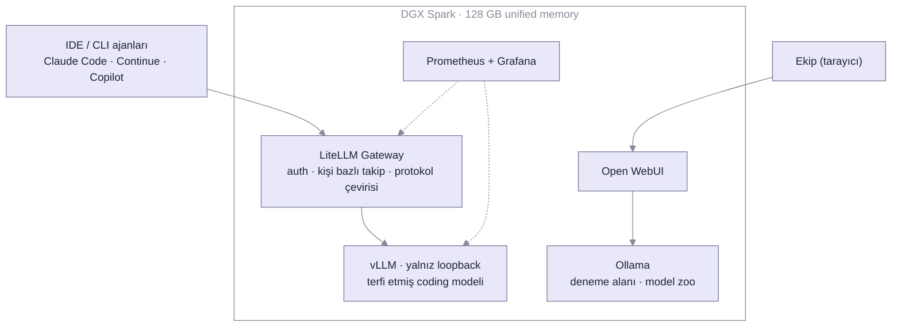

Title: Elimizde Bir NVIDIA DGX Spark Var, Neler Yapabiliriz?
Date: 2026-07-06 10:00
Category: AI
Tags: yapay-zeka, dgx-spark, vllm, litellm, self-hosted
Slug: dgx-spark-ekip-icin-inference-merkezi
Image: images/dgx-spark/dgx-spark-hero.jpeg
Summary: "Elimizde böyle bir cihaz var, neler yapabiliriz?" diye başlayan bir deneme: tek NVIDIA DGX Spark üzerinde chat için Ollama, coding için vLLM + LiteLLM gateway, üstüne monitoring. Ve asıl mesaj: bu kutu nihai inference merkezi değil, o merkezi doğru boyutlandırmak için talebi ölçen pilot platform.


Son aylarda masamda duran bu küçük altın renkli kutuyla uğraşıyorum: [NVIDIA DGX Spark](https://www.nvidia.com/en-us/products/workstations/dgx-spark/). Hikâye bir satın alma analiziyle değil, basit bir merakla başladı. Elimizde böyle bir cihaz vardı ve sorulacak soru belliydi: *bununla neler yapabiliriz?* İnternette hakkında bolca yazı var; çoğu ya "kutudan çıkardım, Ollama kurdum, çalıştı" seviyesinde ya da tek geliştiricinin kendi masası için yaptığı denemeler. Kurcaladıkça soru büyüdü: **bu kutu tek bir kişinin oyuncağı olmaktan çıkıp bir ekibin gerçekten kullandığı, izlenen, ayakta tutulan bir inference altyapısına dönüşebilir mi?**

Cevap: evet, ama iki dipnotla. Birincisi, kurulum rehberlerinin anlattığı kısım işin en kolay yüzde yirmisi; bu yazı kalan yüzde sekseni anlatıyor. İkincisi, bu kutu kimsenin *nihai* inference merkezi değil ve olmaya çalışmamalı; asıl değeri, o nihai merkezi doğru boyutlandırmak için gereken her şeyi ölçebileceğiniz bir pilot platform olması. Bu konuya yazının sonunda döneceğim.

## Kutunun Kendisi: Ne Vaat Ediyor, Ne Vaat Etmiyor

Önce NVIDIA'nın bu kutuyu nasıl sattığına bakalım, çünkü ileride önemli olacak: ürün sayfasındaki tanım ["Desktop Agent Computer"](https://www.nvidia.com/en-us/products/workstations/dgx-spark/), slogan "designed to build and run autonomous agents". Yani üretici bunu bir sunucu olarak değil, geliştiricinin masasındaki AI kutusu olarak konumlandırıyor. Teknik tarafa gelince, kutunun kalbinde GB10 Grace Blackwell çipi var: ARM tabanlı CPU ve Blackwell GPU aynı pakette, ikisi de **128 GB unified memory**'yi paylaşıyor. Bu mimarinin en önemli sonucu şu: klasik "GPU'ya kaç GB VRAM sığar?" sorusu ortadan kalkıyor, çünkü VRAM diye ayrı bir şey yok. İşletim sistemi, container'lar, model ağırlıkları ve KV cache hepsi aynı havuzdan yiyor.

Bu hem en büyük avantaj hem de en büyük tuzak. Avantaj, çünkü 128 GB'a NVFP4 quantization ile [200 milyar parametreye kadar model sığdırabiliyorsunuz](https://vllm.ai/blog/2026-06-01-vllm-dgx-spark); bu boyutta bir modeli tüketici donanımında başka türlü çalıştıramazsınız. Tuzak, çünkü havuzu taşırdığınızda GPU değil *bütün makine* etkileniyor. Buna birazdan geleceğim.

Madalyonun öbür yüzü de var: Spark'ın bellek bant genişliği (~273 GB/s) ayrık GPU'ların çok altında. [Kubesimplify'ın ölçümlerinin de gösterdiği gibi](https://blog.kubesimplify.com/day-1-the-local-llm-revolution-why-your-desk-just-became-the-new-datacenter) tek kullanıcı hızında bir RTX 5090 bu kutuyu geçer. Spark'ın değeri hız değil, **kapasite ve verimlilik**: büyük modeller sığıyor, MoE modellerle throughput iyi ölçekleniyor ve bütün bunlar bir mini PC boyutunda, ofis prizinde çalışan bir cihazda oluyor.

## İlk Karar: Herkes Aynı Kapıdan Girmesin

Bir ekibin LLM ihtiyacı tek tip değil. Gördüğüm kadarıyla iki ayrı kullanım kalıbı var ve ikisini aynı borudan akıtmaya çalışmak iki tarafı da kötüleştiriyor:

1. **Chat**: "Şu maili toparla", "bu dokümanı özetle" tarzı günlük kullanım. Burada önemli olan esneklik: bugün bir model, yarın başkası; kullanıcılar arayüzden seçsin.
2. **Coding**: IDE'lerden ve terminal ajanlarından (Claude Code, Continue, Copilot) gelen yoğun, uzun bağlamlı, tool-call'lu trafik. Burada önemli olan esneklik değil, **tutarlılık ve throughput**: tek iyi model, sürekli sıcak, yüksek eşzamanlılığa dayanıklı.

Bu yüzden mimari iki bağımsız yoldan oluşuyor:

```text
Chat:    Kullanıcı → Open WebUI → Ollama
Coding:  IDE/CLI → LiteLLM gateway → vLLM
```

Ama bu ayrımın ikinci, daha az görünen bir boyutu var ve asıl felsefe orada: **Ollama deneme alanı; vLLM'e ise ancak terfiyle çıkılıyor.** Yeni bir model çıktığında ("X çıkmış, hadi bakalım neymiş") dakikalar içinde Ollama'dan çekip deniyorsunuz; kimseye sormadan, hiçbir config'e dokunmadan. vLLM'e ise model *seçilerek* girer: bu makineye sığan, bu makinenin mimarisine oturan ve denemelerde kendini kanıtlamış **tek bir model**, bütün tuning'iyle birlikte oraya kurulur ve orada sabit kalır. Benimsediğim yaklaşım bu: makineye en iyi oturan modeli vLLM'e koy, merakını Ollama'da gider.

İki yol aynı kutuda, aynı Docker network'ünde ama birbirinden habersiz yaşıyor. Birini kapatıp açmak diğerini etkilemiyor. Bu ayrım kâğıt üstünde küçük bir detay gibi duruyor; pratikte kurulumun ayakta kalmasını sağlayan en önemli karar buydu.

## Ollama Yolu: Deneme Alanı + Ekip Chat'i, Bilerek Sıkıcı

Bu tarafta anlatacak heyecanlı bir şey yok ve bu bilinçli bir tercih. [Ollama](https://ollama.com/) model zoo'yu yönetiyor, [Open WebUI](https://openwebui.com/) üstüne ekip için ChatGPT benzeri bir arayüz koyuyor. Kullanıcı bazlı istatistikler Open WebUI'nin kendi analytics'inde hazır geliyor.

Asıl değeri de tam burada: burası kurulumun **deneme alanı**. Yeni bir model duyurulduğunda onu ciddiye alıp almayacağınıza karar vermenin maliyeti bir `ollama pull`. Beş dakika sonra ekipçe kurcalıyorsunuz, beğenilmezse siliyorsunuz, hiçbir şey kırılmıyor. vLLM tarafında aynı deneme bir operasyon olurdu: quantize edilmiş uygun bir build bul, config değiştir, servisi yeniden başlat, 10-15 dakika reload bekle. Deneme ucuz olmalı ki merak yaşasın; ciddi servis sabit olmalı ki güven yaşasın. İki motoru aynı kutuda tutmanın esprisi bu iş bölümü.

Bir ara "chat trafiğini de gateway'den geçirsem her şey tek yerde izlenir" diye düşündüm. Vazgeçtim: gateway araya girince Ollama'nın pull-and-go esnekliği ölüyor (her yeni model için config değişikliği) ve zaten var olan analytics'i yeniden icat etmiş oluyorsunuz. Bütün trafiği tek kapıya toplamak mimari şıklık gibi görünüyor ama ihtiyaç öyle demiyorsa şıklık değil, yük.

## Coding Yolu: Asıl Mühendislik Burada

Coding trafiği bambaşka bir iş. Bir coding ajanı tek bir "refactor et" isteğinde onlarca paralel istek atabiliyor, bağlamlar on binlerce token, tool-call yoğunluğu yüksek. Ollama'nın tek kullanıcı odaklı yapısı burada yetmiyor; continuous batching, prefix caching ve PagedAttention'ıyla [vLLM](https://docs.vllm.ai/) tam bu iş için yazılmış.

Peki vLLM koltuğuna hangi model oturacak? İşte "her model terfi edemez" dediğim yer burası. Aday modelin dört sınavı birden geçmesi gerekiyor: bu makinenin mimarisine uygun quantize edilmiş hali mevcut mu (Spark için ideali NVFP4, ama her model bu formatta yayınlanmıyor), bellek bütçesine KV cache'iyle birlikte sığıyor mu, Blackwell/`sm_121a` üzerinde kernel'ları sorunsuz çalışıyor mu ve denemelerde gerçekten işinizi görüyor mu? [vLLM'in kendi DGX Spark yazısının da işaret ettiği gibi](https://vllm.ai/blog/2026-06-01-vllm-dgx-spark) bu kutuya en iyi oturan tür **NVFP4 quantize edilmiş MoE modeller**: toplam parametre büyük (bilgi kapasitesi), aktif parametre küçük (bant genişliği dostu). Qwen3.6-35B-A3B gibi bir coding modeli bu profile cuk oturuyor. MTP speculative decoding gibi hız kazandıran ayarlar da var (kayıpsızdır, hedef model her token'ı doğrular) ama bir uyarıyla: bu ayarlar sürüme ve konfigürasyona son derece hassas. Aynı model ailesinde [MTP-2'nin baseline'dan *yavaş* çıktığı ve eşzamanlılık altında istekleri düşürdüğü yayınlanmış ölçümler var](https://rikkarth.com/blog/2026-04-23-benchmark-results-for-qwen-qwen3-6-35b-a3b-fp8-nvidia-dgx-spark-gb10-serving-via-vllm); doğru kombinasyonda ise gerçek kazanç veriyor. Bu tür optimizasyonlarda tek hakem, kendi yükünüzle yaptığınız ölçüm. Ollama'da göz dolduran nice model bu sınavların birine takılıp deneme alanında kalıyor. Bu bir kayıp değil, filtrenin çalıştığını gösteriyor.

### Gateway: Tercih Değil, Zorlama

Buradaki en sevdiğim numara şu: **vLLM'i sadece loopback'e bind edin.** Dışarıdan kimse vLLM'e doğrudan erişemesin; tek giriş kapısı [LiteLLM](https://docs.litellm.ai/) gateway olsun. Bu "lütfen gateway kullanın" ricası değil, ağ seviyesinde bir zorlama. Ekip altyapısında bir kuralın yaşayıp yaşamayacağını da bu belirliyor: rica unutulur, ağ kuralı unutmaz.

Gateway'in getirdikleri:

- **Auth ve kişi bazlı takip**: Her ekip üyesine kendi sanal anahtarı. Kim, hangi IDE'den, ne kadar kullanıyor; hepsi kayıtlı. Bunu ilk günden yapın: ortak bir anahtarla başlayıp sonradan kişi bazlı kırılıma geçmek, dağıttığınız onlarca anahtarı geri toplamak demek.
- **Protokol çevirisi**: vLLM OpenAI API konuşur, Claude Code ise Anthropic Messages API bekler. LiteLLM ikisini de aynı anda sunuyor; [aynı yerel modeli hem Claude Code'a hem Continue'ya bağlayabiliyorsunuz](https://dev.to/dcruver/running-claude-code-with-local-llms-via-vllm-and-litellm-599b). Claude Code'a `ANTHROPIC_BASE_URL` olarak gateway adresini verdiğinizde model, hiç buluta çıkmadan masadaki kutudan cevap veriyor.
- **Psikolojik bir bonus**: Yerel model bedava ama gateway'de modele sembolik bir tarife tanımlarsanız herkes panelinde bir "harcama" görüyor. Kaynak bedava olunca kullanım görünmez oluyor; sahte bir fiyat etiketi bile kullanımı görünür kılıyor.

Mimarinin tamamı tek bakışta şöyle:




## 128 GB'ın Matematiği: Havuzu Taşıran Son Gigabayt

Şimdi baştaki tuzağa dönelim. Unified memory'de vLLM'in `--gpu-memory-utilization` parametresi klasik anlamını yitiriyor: GPU'ya değil, *ortak havuza* ne kadar el koyacağını söylüyorsunuz. Çoğu rehber 0.85-0.90 önerir; tek başına vLLM koşturuyorsanız doğru. Ama aynı kutuda Ollama da yaşayacaksa hesap değişiyor:

```text
~121 GB kullanılabilir havuz (128 GB'ın tamamı sizin değil)
- ~48 GB  vLLM rezervi (0.40 utilization: ağırlıklar + KV cache)
- ~43 GB  işletim sistemi, container'lar, dosya cache, pay
= ~30 GB  Ollama'nın on-demand modeline kalan boşluk
```

Dikkat: **bu 30 GB bir *boşluk*, model tavanı değil.** Bir modelin diskteki ağırlık boyutu, çalışırken kaplayacağı yerin tamamı değil. Pratikte ~27 GB'ın üstünde bir modeli vLLM ile aynı anda ayakta tutmak riskli. "30 GB boşluğum var, 29 GB'lık model sığar" hesabı sizi tam da duvara götürür.

Bu sınırı aştığınızda olanlar, klasik GPU dünyasından alışık olduğunuz senaryo değil: ayrık GPU'da bellek biterse CUDA out-of-memory hatası alırsınız, süreç ölür, hayat devam eder. Unified memory'de ise havuz taşınca sistem **swap'a düşüyor** ve GPU'yla aynı belleği paylaşan her şey (sshd dahil) sürünmeye başlıyor. Makineye SSH bile atamıyorsunuz.

Güç düğmesi de tek başına yetmiyor: makine açılırken servisler geri gelip aynı belleği yeniden istiyor. Bizde reset sonrası, boot penceresi kapanmadan suçlu container'ı `docker rm -f` ile kaldırmak gerekti. Kurtarma planınızı kutuyu kaybetmeden önce yazın. "Bir 30 GB model daha yükleyeyim, ne olacak" dediğiniz an bütün ekibi altyapısız bırakabiliyorsunuz.

Ders: unified memory'li bir kutuda bellek planlaması bir tuning detayı değil, *availability* meselesi. Sınırları config'e gömün, "dikkatli oluruz"a güvenmeyin.

## Asıl Hız Kaldıracı Beklediğiniz Yerde Değil

Yerel LLM konuşması bant genişliği ve token/saniye etrafında dönüyor. Ama bir coding ajanının gecikmesini belirleyen şey, prompt'un **toplam** uzunluğu değil: prefix cache'te bulunmayan, yani gerçekten yeniden hesaplanması gereken token sayısı. Claude Code gibi istemciler her istekte aynı devasa system prompt'u ve tool tanımlarını tekrar gönderir; bu önek cache'e oturduğu sürece maliyeti neredeyse sıfırdır, [vLLM bunu otomatik olarak yapar](https://docs.vllm.ai/en/latest/design/prefix_caching.html). Cache ıskalandığında ise o devasa prefix'in bedelini her seferinde yeniden ödersiniz.

Bunun pratik bir sonucu var ve kurulum rehberlerinin hiçbirinde yazmıyor: **MCP konfigürasyonunuz aslında gecikme bütçenizdir.** Anthropic'in kendi mühendislik yazısı, bağlı araç sayısı arttıkça [bütün tool tanımlarını baştan yüklemenin "ajanları yavaşlattığını ve maliyeti artırdığını"](https://www.anthropic.com/engineering/code-execution-with-mcp) söylüyor. Ama mesele sadece bağlam penceresi değil: yeni bir MCP sunucusu eklemek system prompt'unuzun önekini değiştirir, cache'i ıskalatır ve o "bedava" prefix'in bedelini geri getirir. Çok turlu agentic işlerde cache'i bozmamanın kritikliği [üç büyük sağlayıcı ve üç ayrı caching stratejisi üzerinde akademik olarak da çalışılmış](https://arxiv.org/abs/2601.06007).

Buradan çıkan kural "cache donanımı yener" değil. Daha basiti: **ölçmeniz gereken değişken prompt token sayısı değil, uncached token sayısı.** Yeni donanım almadan önce cache hit oranınıza bakın. Orada duran kazanç, çoğu zaman bir sonraki kartın vaat ettiğinden büyük.

## Hobi Kurulumu ile İşletilen Sistem Arasındaki Çizgi

Buraya kadar anlattıklarım hâlâ bir hafta sonu projesi sayılabilir. Ekip buna gerçekten bel bağlamaya başladığında liste şöyle uzuyor:

**Her imajı pin'leyin.** `latest` tag'i bir ekip altyapısında saatli bomba. Hele Spark gibi görece yeni bir platformda: GB10'un `sm_121a` compute capability'si için her vLLM build'i düzgün derlenmiş gelmiyor; dün çalışan kurulum, bugünkü `pull` ile bozulabiliyor. Upgrade bilinçli bir eylem olmalı: tag'i elle değiştir, arm64 manifest'inin gerçekten var olduğunu kontrol et, sonra yükselt. (GitHub'da release'i olan her sürümün Docker Hub'da multi-arch imajı olmadığını da bu süreçte öğrendim.)

**Sürücüde maceraya gerek yok.** Yeni platformlarda "en yeni sürücü en iyisidir" varsayımı geçerli değil; unified memory + CUDA Graph gibi kombinasyonlarda sürücü regresyonları görülebiliyor. Çalışan bir sürücü serisi bulduysanız, değiştirmek için "yenisi çıkmış"tan daha güçlü bir gerekçeniz olsun.

**Metriksiz kutu kara kutudur.** vLLM'in `/metrics` endpoint'i (token hızı, kuyruk derinliği, KV cache doluluğu) ve LiteLLM'in [Prometheus metrikleri](https://docs.litellm.ai/docs/proxy/prometheus) (kullanıcı, ajan, hata oranı, latency percentile'ları) birlikte Grafana'da toplandığında "yavaş mı acaba?" sorusu tahminden ölçüme dönüşüyor. Kim hangi IDE'den geliyor, p95 latency ne, hata oranı sıçradı mı; hepsi tek panoda.

**Alarm kurun ama sessiz alarm kurun.** Beş dakikada bir sağlığı kontrol eden basit bir cron script'i yeter: container'lar ayakta mı, health endpoint'ler yeşil mi, RAM taşıyor mu. Kritik detay, script'in **sadece sorun varken** ses çıkarması ve aynı alarmı iki saat geçmeden tekrarlamaması. Her gün "her şey yolunda" maili atan sistemin gerçek alarmı bir hafta içinde spam klasöründe kaybolur.

**Bakım penceresini baştan tanımlayın.** vLLM'de model reload'u 10-15 dakika sürebiliyor ve bu süre boyunca health endpoint kırmızı. Bakım penceresi kavramınız yoksa her planlı işlemde alarm sistemi yangın var sanıyor; iki hafta sonra da kimse alarmlara bakmıyor. "Şu servisler için 20 dakika sessiz kal" diyebilen tek satırlık bir mekanizma, alarm sisteminin güvenilirliğini kurtarıyor.

Bunların hiçbiri roket bilimi değil. Ama kurulum rehberlerinin hiçbirinde yer almıyor ve "ekip bu kutuya güveniyor mu?" sorusunun cevabı tam olarak bu listede saklı.

## Büyük Resim: Bu Kutu Merkez Değil, Merkezin Keşif Aracı

Baştaki ikinci dipnota geldik. Ve ilginç olan şu: bu benim yorumum bile değil, üreticinin kendi ifadesi. NVIDIA'nın [ürün sayfası](https://www.nvidia.com/en-us/products/workstations/dgx-spark/) hedef kitleyi saklamıyor ("ideal for AI developer, researcher, and data scientist workloads") ve prototipleme iş yükünü aynen şöyle tarifliyor: modelini geliştir, test et, doğrula, sonra *"eventual migration to the NVIDIA DGX cloud or other NVIDIA-accelerated data centers"*. Inference başlığında bile seçilen fiiller "test" ve "validate". Bu kutuda geliştirdiğiniz işin eninde sonunda başka bir yere taşınacağını üretici baştan söylüyor. vLLM'in resmi DGX Spark yazısı da aynı çizgide: *["DGX Spark is better suited to small-batch inference than high-concurrency serving"](https://vllm.ai/blog/2026-06-01-vllm-dgx-spark)*; bu yüzden `--max-num-seqs` düşük tutulmalı diyorlar. Bunu bir eksiklik olarak değil, ürünün ne olduğunun dürüst tanımı olarak okumak gerekiyor: bu bir geliştirici kutusu, ekip sunucusu kılığına sokulabiliyor olması onu sunucu yapmıyor.

Rakamlar da aynı şeyi söylüyor. Tek kullanıcı hızı için [aynı sınıf bir MoE coding modeliyle GB10 üzerinde yayınlanmış benchmark'lar](https://rikkarth.com/blog/2026-04-23-benchmark-results-for-qwen-qwen3-6-35b-a3b-fp8-nvidia-dgx-spark-gb10-serving-via-vllm) ~28-30 tok/s civarını gösteriyor. O ölçümün FP8 olduğunu not düşeyim; NVFP4'te tablo değişir. Eşzamanlılık tarafında ise motoru yazanların kendi ifadesinden iyi kaynak yok ve yukarıda alıntıladığım cümle net: bu kutu yüksek eşzamanlılıklı serving için değil, küçük batch'ler için. Pratikte rahat çalışma bölgesi bir avuç eşzamanlı istek; ötesinde kullanıcı başına gecikme chat için hantallaşıyor. Agentic kullanım bu hesabı daha da sıkıştırıyor: tek bir Claude Code oturumu sürekli, bazen paralel istek üretir; yoğun çalışan tek bir kullanıcı birkaç slotu tek başına işgal edebilir. Yani bu kutu bir avuç ağır kullanıcıyı ve makul bir hafif kullanıcı kitlesini taşır; yüzlerce kişiye hizmet verecek gerçek bir inference merkezi başka sınıf donanım ister. 2026 itibarıyla o sınıfta fiyat/performans dengesinin en iyi olduğu yer, [96 GB VRAM'li RTX Pro 6000 Blackwell](https://www.thundercompute.com/blog/nvidia-rtx-pro-6000-pricing) gibi kartlarla kurulmuş bir vLLM sunucusu: 1.8 TB/s bellek bant genişliği (Spark'ın yaklaşık 7 katı) ve [tek kart yüklerinde H100 SXM'i throughput'ta geçip token maliyetini %28 düşüren ölçümler](https://www.cloudrift.ai/blog/benchmarking-rtx6000-vs-datacenter-gpus). Peki ikinci bir Spark almak? Cevap amaca göre değişiyor; merdivenin ilk basamağı tam olarak bu.

### Sonrası İçin: Ölçek Merdiveni

Bu yazının kapsamı dışında ama "gateway verisi büyüme diyor" noktasına gelenler için merdivenin basamakları belli ve her basamağın yayınlanmış ölçümü var:

- **2x DGX Spark (256 GB birleşik bellek): keşfin devamı.** Kutunun arkasındaki ConnectX portu tam bunun için var: [NVIDIA iki Spark'ın bağlanıp 405 milyar parametreye kadar modellerle çalışmasını resmi olarak destekliyor](https://www.nvidia.com/en-us/products/workstations/dgx-spark/) ve [multi-node kurulum artık resmi araçlarla yapılıyor](https://developer.nvidia.com/blog/run-local-ai-agents-with-faster-models-and-multi-node-clustering-on-nvidia-dgx-spark/). Topluluk ölçümleri de fena değil: [vLLM ile TP=2'de gpt-oss-120b ~80 tok/s'ye çıkıyor](https://forums.developer.nvidia.com/t/vllm-0-17-0-mxfp4-patches-for-dgx-spark-qwen3-5-35b-a3b-70-tok-s-gpt-oss-120b-80-tok-s-tp-2/362824), [vLLM+Ray ile iki Spark'ı tek cluster'a çeviren adım adım anlatımlar](https://medium.com/@michaelperes1/turning-two-dgx-sparks-into-a-local-llm-cluster-with-vllm-ray-and-qwen3-6-7eb2a6e04ade) mevcut. Yani deneme hikâyesi tek kutuyla bitmek zorunda değil: bir boy büyük modellerin de yerelde tadına bakıp "kalite sıçraması bize değer mi?" sorusunu satın alma öncesi cevaplayabilirsiniz. Ama beklentiyi doğru kurun: bu basamak *daha büyük modelleri* denemenin yolu, çok kullanıcılı serving sorununun çözümü değil; kutu başına 273 GB/s bant genişliği duvarı ikinci kutuyla ortadan kalkmıyor. Dert kapasite değil eşzamanlılıksa, o bütçeyi bir sonraki basamağa saklayın.
- **1-2x RTX Pro 6000 (96-192 GB VRAM).** İlk gerçek üretim basamağı. [CloudRift'in H100/H200 karşılaştırması](https://www.cloudrift.ai/blog/benchmarking-rtx6000-vs-datacenter-gpus) tek kart senaryosunda net konuşuyor: PRO 6000, H100 SXM'den daha yüksek throughput (3,140'a karşı 2,987 tok/s) ve %28 daha düşük token maliyeti veriyor; kart fiyatı ise H100'ün yaklaşık üçte biri. [gpt-oss-120b sınıfı bir model MXFP4 ile tek karta sığıyor](https://www.databasemart.com/blog/vllm-gpu-benchmark-pro6000) ve kart üç motorda da (vLLM/SGLang/TensorRT-LLM) tam destekli.
- **8x RTX Pro 6000 (768 GB VRAM).** DeepSeek/GLM sınıfı dev MoE'lerin 4-bit servis kapısı. Ama sınırını bilerek: bu kartlarda NVLink yok ve [8 kartlı tensor parallelism'de NVLink'li H100/H200 3-4 kat öne geçiyor](https://www.cloudrift.ai/blog/benchmarking-rtx6000-vs-datacenter-gpus). Model 1-2 karta sığdığı sürece fiyat/performansta açık ara öndesiniz; 8 kartı tek modele bölmeye başladığınız an ekonomi tersine dönüyor.
- **8x H200 HGX (1.1 TB HBM).** Teknik tavan. [GPUStack'in optimizasyon çalışması](https://docs.gpustack.ai/2.0/performance-lab/deepseek-r1/h200/) DeepSeek-R1 671B'yi tek node'da, gerçekçi ShareGPT yükünde toplam ~7,100 tok/s ile servis ediyor (ilginç detay: motor seçimi tek başına %30 fark yaratıyor, o testte SGLang vLLM'i geçiyor). [Uzun bağlamda fark daha da açılıyor](https://medium.com/data-science-collective/benchmarking-llm-inference-on-nvidia-b200-h200-h100-and-rtx-pro-6000-66d08c5f0162): 16K bağlamlı yüklerde Blackwell/Hopper datacenter kartları PRO 6000'in ~5 katına varan throughput veriyor. Karşılığı da o ölçüde: kart başına ~$35k'dan sekiz kart, üstüne ~10 kW güç ve ciddi soğutma. Bu artık ofis odası değil, veri merkezi işi.

Hangi basamak ne zaman mantıklı? O da tahmin değil, hesap işi. [Lenovo'nun 2026 TCO analizi](https://lenovopress.lenovo.com/lp2368-on-premise-vs-cloud-generative-ai-total-cost-of-ownership-2026-edition) 8x H100 sınıfı bir sunucunun (~$250k CapEx) yoğun kullanımda cloud on-demand'e karşı ~3.7 ayda, bir yıllık reserved fiyata karşı bile ~6 ayda başabaş geldiğini hesaplıyor. [Daha temkinli akademik analizler](https://arxiv.org/html/2509.18101v3) ise on-prem'in anlamlı olması için aylık ~50M token hacim ya da veri yerleşimi (data residency) zorunluluğu arıyor. İki analizi ayıran değişken aynı: sizin *gerçek* token hacminiz. Satın almadan önce ara adım isteyenler için [RTX Pro 6000 saatlik $0.72-2.43'e kiralanabiliyor](https://getdeploying.com/gpus/nvidia-rtx-pro-6000); hedef modeli kendi yükünüzle önce bulutta test etmek de merdivenin görünmez basamağı.

Peki bu kurulum boşa emek mi? Tam tersi; yazının asıl mesajı bu. Büyük donanım yatırımlarının en riskli hali, talebi bilmeden yapılanı: dereyi görmeden paçaları sıvamak. Bu kutu, o talebi *ölçmenin* neredeyse bedava yolu: gateway zaten kullanıcı başına token, istek sayısı, tepe eşzamanlılık ve gecikmenin hantallaştığı saat dilimlerini kaydediyor. Birkaç haftalık gerçek kullanım verisi, "hangi donanımı, ne zaman, hangi kapasiteyle almalıyız" sorusunun cevabını kendiliğinden önünüze koyar. [VMware'in kendi iç LLM servisi için yaptığı çalışma](https://blogs.vmware.com/cloud-foundation/2026/04/30/how-many-users-can-your-llm-server-really-handle/) aynı yaklaşımı anlatıyor: önce kullanıcı profillerini ölç, donanımı sonra boyutlandır.

Ve gateway mimarisinin uzun vadeli getirisi tam burada ortaya çıkıyor: gün gelip arkaya daha büyük bir sunucu koyduğunuzda LiteLLM katmanı, anahtarlar ve izleme panoları aynen kalıyor. Kullanıcılar hiçbir değişiklik görmeden yeni motora geçiyor; Spark da hak ettiği role, geliştirici deney kutusuna dönüyor. Yani bugün kurduğunuz hiçbir şey çöpe gitmiyor; sadece en pahalı parça değişiyor.

## Kime Mantıklı?

Elimdeki tabloya bakınca:

- **Veri dışarı çıkmıyor.** Coding ajanına açtığınız her dosya sizin ağınızda kalıyor. Kaynak koduna hassasiyeti olan herhangi bir ortam için bu tek başına yeterli gerekçe olabilir.
- **Maliyet öngörülebilir *hale gelir*.** Cloud API'de yoğun coding-agent kullanımı faturayı hızla büyütüyor. Ama "kaç ayda başabaş" sorusunun tek dürüst cevabı sizin token hacminiz; yukarıdaki iki analizin ayrıştığı yer de tam olarak orası. Bu kutunun asıl işi zaten o hacmi ölçmek. Elektrik masrafı ise lafını etmeye değmez.
- **Sınırlar net.** Frontier modellerin (Claude, GPT) muhakeme derinliğini yerelden beklemeyin; 35B sınıfı bir MoE coding modeli günlük işlerin büyük kısmını taşıyor ama en zor mimari kararlarda fark hissediliyor. Yüzlerce kişilik eşzamanlı yük de tek kutunun işi değil, ama bir üstteki bölümde anlattığım gibi zaten amaç o değil: amaç, o yükün gerçekte ne olduğunu öğrenmek.

Benim için asıl kazanım şuydu: "yerel LLM" konuşması genelde donanım ve token/saniye etrafında dönüyor. Halbuki bir ekibin buna gerçekten güvenmesi için gereken şeyler başka yerde: doğru yol ayrımı, zorlanmış bir giriş kapısı, bellek disiplini, gözlemlenebilirlik ve sıkıcı ama vazgeçilmez operasyon pratikleri. Kutu bir hafta sonunda kurulur; *altyapı* haftalarca işletilerek olur.

---

*Bu konuda derinleşmek isteyenler için başlangıç noktaları: [vLLM'in DGX Spark yazısı](https://vllm.ai/blog/2026-06-01-vllm-dgx-spark) (mimari ve flag'ler), [Claude Code + LiteLLM + vLLM kurulum yazısı](https://dev.to/dcruver/running-claude-code-with-local-llms-via-vllm-and-litellm-599b) (gateway zinciri), [Kubesimplify'ın 7 günlük Spark serisi](https://blog.kubesimplify.com/day-1-the-local-llm-revolution-why-your-desk-just-became-the-new-datacenter) (ölçümler) ve [inference engine karşılaştırması](https://medium.com/@michael.hannecke/four-inference-engines-one-box-when-to-use-which-on-the-dgx-spark-6b32a53db768) (vLLM/SGLang/llama.cpp/TensorRT-LLM seçimi).*
